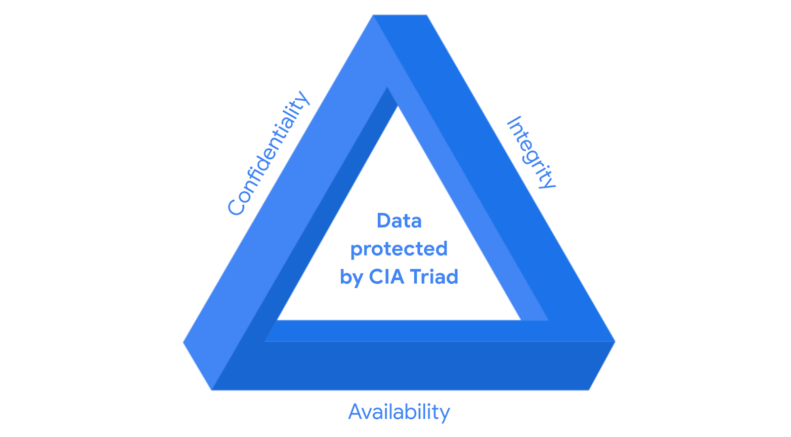

# Introduction 

**Security frameworks**: guidelines used for building plans to help mitigate risks and threats to data and privacy. 
- Provide a structured approach to implementing a security lifecycle.  
- Security lifecycle: a constantly evolving set of policies and standards that define how an organization manages risks, follows established guidelines, and meets regulatory compliance, or laws.
- Four core components:
    - Identifying and documenting security goals. 
        - Ex.: an organization may have a goal to align with the E.U.'s General Data Protection Regulation, also known as GDPR. GDPR is a data protection law established to grant European citizens more control over their personal data. A security analyst may be asked to identify and document areas where an organization is out of compliance with GDPR.  
    - Setting guidelines to achieve security goals. 
        - Ex.: when implementing guidelines to achieve GDPR compliance, your organization may need to develop new policies for how to handle data requests from individual users.  
    - Implementing strong security processes. 
        - In the case of GDPR, a security analyst working for a social media company may help design procedures to ensure the organization complies with verified user data requests. 
        - Ex.: when a user attempts to update or delete their profile information.
    - Monitoring and communicating results.  
        - Ex.: you may monitor your organization's internal network and report a potential security issue affecting GDPR to your manager or regulatory compliance officer.

**Security controls**: safeguards designed to reduce specific security risks. 
    - Ex.: your company may have a guideline that requires all employees to complete a privacy training to reduce the risk of data breaches. As a security analyst, you may use a software tool to automatically assign and track which employees have completed this training.

# Secure design

CIA triad is a foundational model that helps inform how organizations consider risk when setting up systems and security policies. CIA stands for confidentiality, integrity, and availability.

- Confidentiality: only authorized users can access specific assets or data. 
    - Ex.: strict access controls that define who should and should not have access to data, must be put in place to ensure confidential data remains safe.
- Integrity: data is correct, authentic, and reliable. 
    - To maintain integrity, security professionals can use a form of data protection like encryption to safeguard data from being tampered with.
- Availability: data is accessible to those who are authorized to access it. 

Some terms:
    - Asset is an item perceived as having value to an organization.  
    - Value is determined by the cost associated with the asset in question.  
        Ex.: an application that stores sensitive data, such as social security numbers or bank accounts, is a valuable asset to an organization. It carries more risk and therefore requires tighter security controls in comparison to a website that shares publicly available news content.

# Controls, frameworks, and compliance
The confidentiality, integrity, and availability (CIA) triad is a model that helps inform how organizations consider risk when setting up systems and security policies. 

Security controls + frameworks: ensure that security goals and processes are implemented correctly and that organizations meet regulatory compliance requirements.

Four security frameworks core components:
- Identifying and documenting security goals.  
- Setting guidelines to achieve security goals.  
- Implementing strong security processes.  
- Monitoring and communicating results.  

## Compliance 
The process of adhering to internal standards and external regulations.

## Specific controls, frameworks, and compliance
The National Institute of Standards and Technology (NIST) is a U.S.-based agency that develops multiple voluntary compliance frameworks that organizations worldwide can use to help manage risk. The more aligned an organization is with compliance, the lower the risk.

Ex.: NIST Cybersecurity Framework (CSF) and the NIST Risk Management Framework (RMF). 

Note: Specifications and guidelines can change depending on the type of organization you work for.

There are several other controls, frameworks, and compliance standards that are important for security professionals to be familiar with to help keep organizations and the people they serve safe.

## The Federal Energy Regulatory Commission - North American Electric Reliability Corporation (FERC-NERC)
A regulation that applies to organizations that work with electricity or that are involved with the U.S. and North American power grid. 
- Prepare for, mitigate, and report any potential security incident that can negatively affect the power grid.  
- Legally required to adhere to the Critical Infrastructure Protection (CIP) Reliability Standards defined by the FERC. 

## The Federal Risk and Authorization Management Program (FedRAMP®)
A U.S. federal government program that standardizes security assessment, authorization, monitoring, and handling of cloud services and product offerings. 
- Provide consistency across the government sector and third-party cloud providers. 

## Center for Internet Security (CIS®)
A nonprofit with multiple areas of emphasis. Set of controls that can be used to safeguard systems and networks against attacks.
- Help organizations establish a better plan of defense.  
- Provides actionable controls that security professionals may follow if a security incident occurs. 

## General Data Protection Regulation (GDPR)
A European Union (E.U.) general data regulation that protects the processing of E.U. residents’ data and their right to privacy in and out of E.U. territory.
- Ex.: if an organization is not being transparent about the data they are holding about an E.U. citizen and why they are holding that data, this is an infringement that can result in a fine to the organization.
- If a breach occurs and an E.U. citizen’s data is compromised, they must be informed. The affected organization has 72 hours to notify the E.U. citizen about the breach.

## Payment Card Industry Data Security Standard (PCI DSS)
An international security standard meant to ensure that organizations storing, accepting, processing, and transmitting credit card information do so in a secure environment.
- Reduce credit card fraud. 

## The Health Insurance Portability and Accountability Act (HIPAA)
A U.S. federal law established in 1996 to protect patients' health information.
- Prohibits patient information from being shared without their consent. 
- Governed by three rules:  
    - Privacy.  
    - Security.  
    - Breach notification.

Organizations that store patient data have a legal obligation to inform patients of a breach because if patients' Protected Health Information (PHI) is exposed, it can lead to identity theft and insurance fraud. 
PHI relates to the past, present, or future physical or mental health or condition of an individual, whether it’s a plan of care or payments for care. 

## Health Information Trust Alliance (HITRUST®) 
A security framework and assurance program that helps institutions meet HIPAA compliance.

## International Organization for Standardization (ISO) 
Created to establish international standards related to technology, manufacturing, and management across borders.
- Helps organizations improve their processes and procedures for staff retention, planning, waste, and services. 

## System and Organizations Controls (SOC type 1, SOC type 2)
The American Institute of Certified Public Accountants® (AICPA) auditing standards board developed this standard. The SOC1 and SOC2 are a series of reports that focus on an organization's user access policies at different organizational levels such as: 
- Associate.  
- Supervisor.  
- Manager.  
- Executive.  
- Vendor.  
- Others.  

They are used to assess an organization’s financial compliance and levels of risk. They also cover confidentiality, privacy, integrity, availability, security, and overall data safety. Control failures in these areas can lead to fraud.