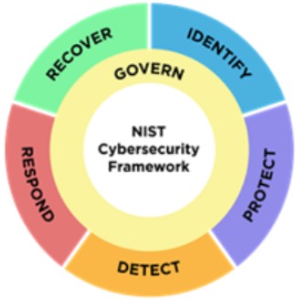

# Introduction
Purpose of frameworks: orgs use as a starting point to develop plans to mitigate risks, threats and vulnerabilities to
sensitive data and assets.

National Institute of Standards and Technology (NIST):  
- Profit and nonprofit business  
- Goverment agencies  
- US based, but used all over the world  
- SP 800-53: Special Publication protect security of info systems within federal goverment.  

# NIST Cybersecurity Framework (NIST CSF)

A voluntary framework that consists of standards, guidelines, and best practices to manage
cybersecurity risk. Six important core functions:
- Govern (new!)  
    - Emphasizes the importance of strong cybersec governance accross all levels of the org  
    - Establishing and maintaining the structures and processes needed to effectively manage cybersec risk  
    - Ex.: setting clear cybersec objectives, ensure leadership commitment, developing and  implementing a comprehensive risk 
    management strategy.  
- Identify  
    - Management of cybersec risk and its effect on an org's people and assets.
    - Ex.: monitor systems and devices in an org's internal network to identify potential security issues.  
- Protect  
    - Strategy used to protect an org through the implementation of policies, procedures, training, and tools
    that help mitigate cybersec threats. 
    - Ex.: studying historical data and making improvement to policies and procedures.   
- Detect  
    - Identifying potential security incidents and improving monitoring capabilities to increase speed
    and efficiency of detections.  
    - Ex.: review a sec tool's setup to make sure it's flagging low, medium, or high risk, and then alerting the sec team
    about any potential threats or incidents.  
- Respond  
    - Making sure that the proper procedures are used to contain, neutralize, and analyze security incidents, and implement
    improvements to the security process.  
    - Ex.: collect and organize data to document and incident and suggest improvements to processes to prevent the incident
    from happening again.  
- Recover  
    - Returning the affected systems back to normal operation.  
    - Ex.: Retore systems, data, and assets that have been affected by an incident like a breach.

